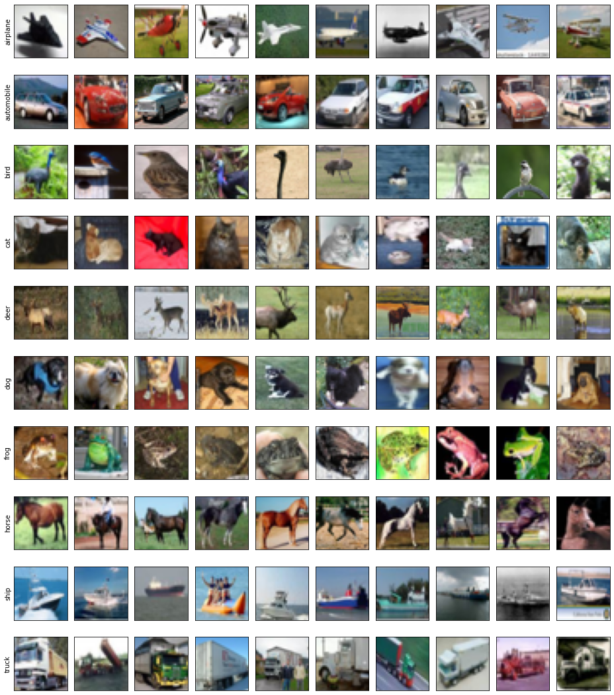

# ciFAIR-10/100 Dataset

ciFAIR is a variant of the popular CIFAR dataset, which uses a slightly modified test set avoiding near-duplicates between training and test data.
It comprises RGB images of size 32x32 spanning 10 and 100 classes of everyday objects for ciFAIR-10 and ciFAIR-100, respectively.

CIFAR homepage: <https://www.cs.toronto.edu/~kriz/cifar.html>  
CIFAR paper: <https://www.cs.toronto.edu/~kriz/learning-features-2009-TR.pdf>

ciFAIR homepage: <https://cvjena.github.io/cifair/>  
ciFAIR Paper: <https://arxiv.org/abs/1902.00423>

## Splits

We use the following splits of the ciFAIR-10/100 dataset for testing small-data performance:

|   Split   | Total Images | Images / Class |
|:----------|-------------:|---------------:|
| train     |  300 / 3,000 |             30 |
| val       |  200 / 2,000 |             20 |
| trainval  |  500 / 5,000 |             50 |
| test      |       10,000 |    1,000 / 100 |

`train` comprises the first 30 training images from each class and `val` the following 20.
`trainval` is a combination of both.
`test` is the full original ciFAIR-10 test set.

## Baseline Performance

We achieved the following baseline performance using a Wide ResNet 16-8 trained on the `trainval` split and averaged over 10 runs.

| Dataset Variant | Accuracy |
|:----------------|---------:|
| ciFAIR-10       |   58.22% |
| ciFAIR-100      |   53.42% |
