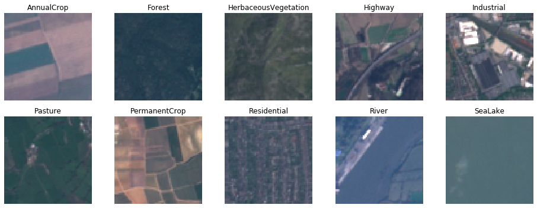

# EuroSAT Land Cover Classification Dataset

EuroSAT is a multispectral image dataset based on Sentinel-2 satellite images of size 64x64 covering 13 spectral bands and consisting out of 10 classes with in total 27,000 labeled images.

Dataset homepage: <https://github.com/phelber/eurosat>  
Paper: <https://ieeexplore.ieee.org/document/8736785/>

## Obtaining the data

The bash script `download_data.sh` provided in this directory can be used to download the actual image data.
Doing so will result in two folders: `RGB` containing JPEG true color images of the RGB-channels and `allBands` containing TIFF files storing all 13 spectral bands.

## Splits

We provide the following splits of the dataset for testing small-data performance:

|   Split   | Total Images | Images / Class |
|:----------|-------------:|---------------:|
| train     |          300 |             30 |
| val       |          200 |             20 |
| trainval  |          500 |             50 |
| test      |       19,500 |          1,950 |

## Baseline Performance

We achieved the following baseline performance using a ResNet-50 trained on the `trainval` split and averaged over 10 runs.

| Dataset Variant | Accuracy |
|:----------------|---------:|
| RGB             |   82.43% |
| Multispectral   |   90.27% |

## Bands

The multispectral data consists of 13 channels ("bands") with the following meanings:

| Band |     Name     | Resolution | Wave Length |
|-----:|:-------------|-----------:|------------:|
|  00  | Aerosols     |       60 m |      443 nm |
|  01  | Blue         |       10 m |      490 nm |
|  02  | Green        |       10 m |      560 nm |
|  03  | Red          |       10 m |      665 nm |
|  04  | Red edge 1   |       20 m |      705 nm |
|  05  | Red edge 2   |       20 m |      740 nm |
|  06  | Red edge 3   |       20 m |      783 nm |
|  07  | NIR          |       10 m |      842 nm |
|  08  | Red edge 4   |       20 m |      865 nm |
|  09  | Water vapor  |       60 m |      945 nm |
|  10  | Cirrus       |       60 m |     1375 nm |
|  11  | SWIR 1       |       20 m |     1610 nm |
|  12  | SWIR 2       |       20 m |     2190 nm |

One image pixel has a resolution of 10x10 meters.
