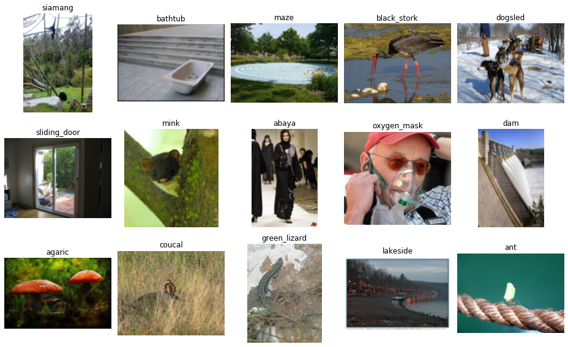

# ImageNet Large Scale Visual Recognition (ILSVRC) 2012 Dataset

ILSVRC 2012 is a large dataset of over one million web-sourced natural images spanning 1,000 classes.

Dataset homepage: <http://image-net.org/challenges/LSVRC/2012/index>  
Paper: <https://link.springer.com/article/10.1007/s11263-015-0816-y>

## Obtaining the data

The dataset is only available on [Kaggle][1] and downloading requires a Kaggle account.
To obtain the dataset, perform the following steps:

- Register and log-in on Kaggle.
- From the [ImageNet competition page][1], download the file `imagenet_object_localization_patched2019.tar.gz`.
- Extract the images from the downloaded file:  
  `tar -xvzf imagenet_object_localization_patched2019.tar.gz ILSVRC/Data`
- Move the directories with the training and validation images to the current directory and rename them:  
  `mv ILSVRC/Data/CLS-LOC/train ILSVRC2012_img_train`  
  `mv ILSVRC/Data/CLS-LOC/val ILSVRC2012_img_val`
- Remove the directory `ILSVRC`, which we do not need anymore:  
  `rm -R ILSVRC`

## Splits

We subsampled 50 images per class for testing the training performance on small datasets. This `trainval` split is furthermore subdivided into `train` and `val`. The test data is identical with the original ILSVRC test set.

|   Split   | Total Images | Images / Class |
|:----------|-------------:|---------------:|
| train     |       30,000 |             30 |
| val       |       20,000 |             20 |
| trainval  |       50,000 |             50 |
| test      |       50,000 |             50 |

## Baseline Performance

We achieved a baseline classification accuracy of **44.97%** (averaged over 10 runs) using a ResNet-50 trained on the `trainval` split.

[1]: https://www.kaggle.com/c/imagenet-object-localization-challenge/data
