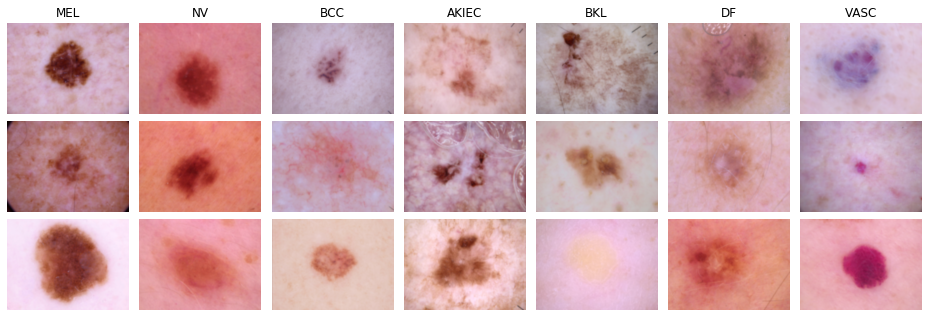

# ISIC 2018 Skin Lesion Classification Dataset

The _International Skin Imaging Collaboration (ISIC) 2018 Challenge_ comprises 10,015 dermoscopic skin lesion images, annotated with one of seven possible skin disease types.

Dataset homepage: <https://challenge.isic-archive.com/landing/2018/47>  
Paper: <https://arxiv.org/abs/1902.03368>

## Obtaining the data

The bash script `download_data.sh` provided in this directory can be used to download the actual image data and original annotations.
Doing so will result in a folder `ISIC2018_Task3_Training_Input` containing the images and a file `ISIC2018_Task3_Training_GroundTruth.csv` with the original annotations.

## Splits

The original dataset is imbalanced, so we created the following non-exhaustive but balanced split:

|   Split   | Total Images | Images / Class |
|:----------|-------------:|---------------:|
| train     |          350 |             50 |
| val       |          210 |             30 |
| trainval  |          560 |             80 |
| test      |        1,944 |         35-400 |

Note that the test set is still imbalanced.
Therefore, balanced accuracy should be used to assess performance instead of plain accuracy.

## Baseline Performance

We achieved a baseline performance of **66.19%** in terms of balanced accuracy (averaged over 10 runs) using a ResNet-50 trained on the `trainval` split.
